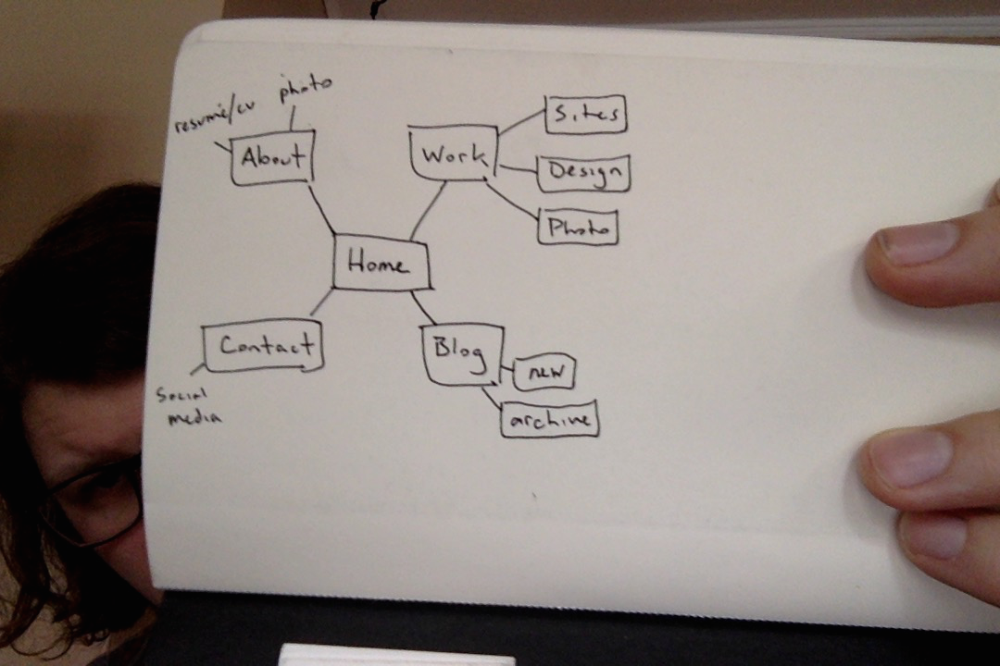

## What are the 6 Phases of Web Design?

⋅⋅* Info Gathering
⋅⋅* Planning
⋅⋅* Design
⋅⋅* Development
⋅⋅* Testing & Delivery
⋅⋅* Maintenance

## What is your site's primary goal or purpose? What kind of content will your site feature?

The goal of my site is to feature enough info about me and my work that I will appear capable and relevant enough to be hired by an employer. To do this I will need to have an enjoyable user interface that will allow navigation to examples of my work, information about me, social media, and a way to contact me.

## What is your target audience's interests and how do you see your site addressing them?

My target audience's interest in finding a qualified and personable candidate for a junior programmer job opening. A good user interface is the most immediate way to address this, followed by examples of good programming, and social media or a blog to show my voice, researching skill, and positive interaction with my community.

## What is the primary "action" the user should take when coming to your site? Do you want them to search for information, contact you, or see your portfolio? It's ok to have several actions at once, or different actions for different kinds of visitors.

The primary action should be viewing my work, the viewer shouldn't have to search father than clicking "contact" or "about" to get information or the ability to contact me.

## What are the main things someone should know about design and user experience?

It should be visually pleasant without being overwhelming or underdesigned, it should navigate smoothly with all relevant info easily accessible. If it looks bad or is poorly organized you will loose the attention span of your audience.

## What is user experience design and why is it valuable?

User Experience Design (UX) is the front end design of a web site. Rather than the behind the scenes programming this is the part the audience sees and interects with. This is important because it creates the whole feel and look of your site and is what will either draw in and engage or repel and infuriate your visitors.

## Which parts of the challenge did you find tedious?

For me the most tedious parts of this challenge have been typing out a path and filename in the shell and using branches. I recognize both as important steps and soon I probably won't think twice about them.

