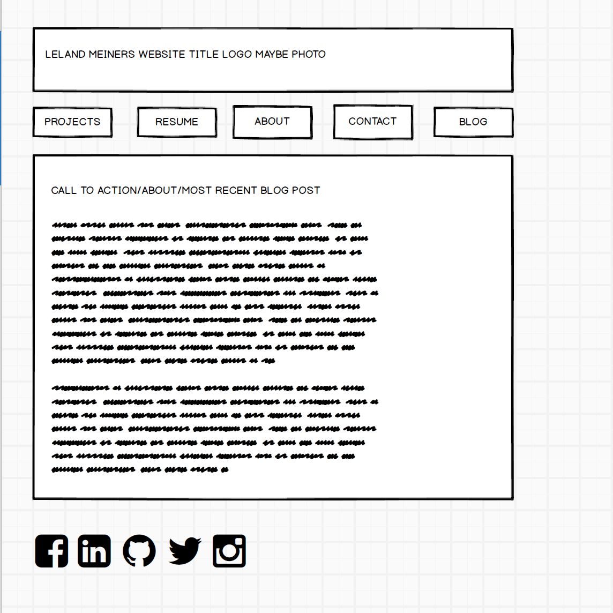
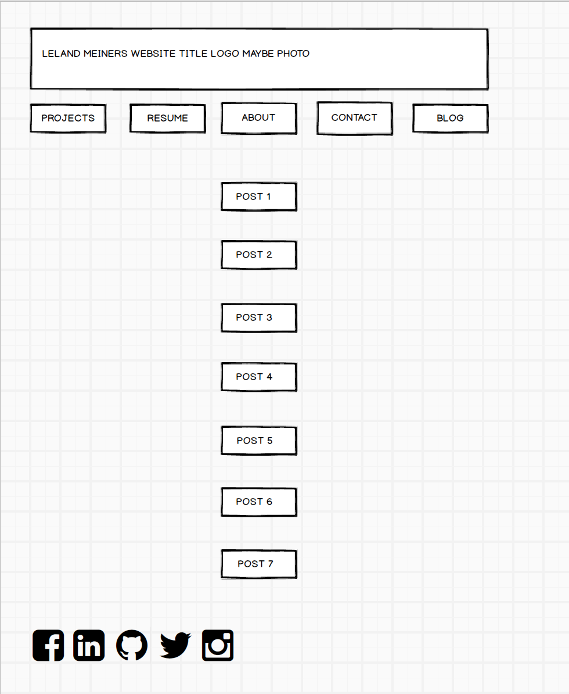

## What is a wireframe?
A wireframe is like a sketch of a website, it can be low fidelity on paper or high fidelity made with images of actual buttons. It is used to figure out the desired structure or flow of a site in the planning stage.

## What are the benefits of wireframing?
Wireframing lets you plan how you want your site to be structured so you can show ideas to your client and have a plan when you start building the site.

## Did you enjoy wireframing your site?
I enjoyed wireframing my site and see that it has the potential to also become very involved and not jsut a sketch.

## Did you revise your wireframe or stick with your first idea?
I revised my wireframe once I added all my elements.

## What questions did you ask during this challenge? What resources did you find to help you answer them?
I referred back to the module to see what elements needed to be accounted for in the index and blog index. I also check back with the earlier links for structural ideas and ended up using a program called Balsamiq that was recommended in the reading and video.

## Which parts of the challenge did you enjoy and which parts did you find tedious?
I enjoyed browsing through the wireframe resource links for ideas and trying out Balsamiq to create a wireframe. It is a nice first program to try but I'm eager to look into others as well. The most tedious part was taking screenshots of my work in Balsamiq because it saves in it's own file type rather than jpg or png.