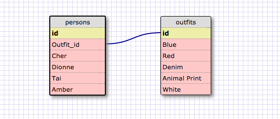

## 8.4 SQL Challenge

1. SELECT * FROM states;

2. SELECT * FROM regions;

3. SELECT state_name, population FROM states;

4. SELECT state_name, population FROM states ORDER BY population DESC;

5. SELECT state_name from states WHERE region_id = 7;

6. SELECT state_name, population_density FROM states WHERE population_density > 50 ORDER BY population_density ASC;

7. SELECT state_name FROM states WHERE population BETWEEN 1000000 and 1500000;

8. SELECT state_name, region_id FROM states ORDER BY region_id ASC;

9. SELECT region_name FROM regions WHERE region_name LIKE '%central%';

10. SELECT region_name, state_name FROM regions, states ORDER BY region_id ASC;

## Schema

## Reflection
### What are databases for?
Databases exist to organize large amounts of information in a way where it can be accessed, sorted, or combined.

### What is a one-to-many relationship?
A one-to-many relationship is one of three types of database relationships between tables, the one-to-one, one-to-many, and many-to-many. 

The one-to-many relationship means a row from one table can have multiple matching rows in another table. This could be the state or country field in a table of billing addresses, where there is a set amount of possibilities that exist in the table linked with a foreign key.

### What is a primary key? What is a foreign key? How can you determine which is which?
A primary key is a field (column) that is attached to the table to identify each row, like an id number. A foreign key is an column in a table that displays values from another table, in a schema they are linked. A schema is helpful is determining how they all relate. 

### How can you select information out of a SQL database? What are some general guidelines for that?
To core command to get information out of a SQL database is "SELECT ___ FROM ____" where the first blank is the field or fields you want and the second is the database you are pulling from. After that you may add conditions or sorting methods for what or how it is displayed. 

