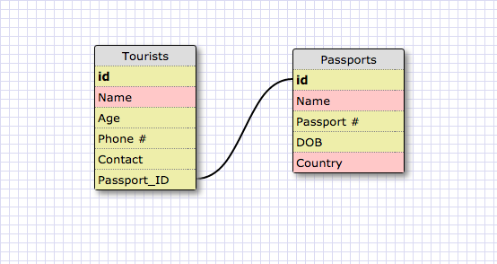
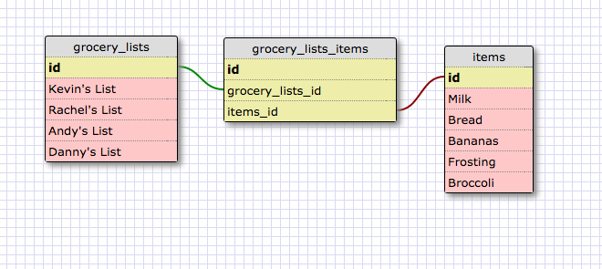

##Create a One-to-one Schema
In this one-to-one schema there is a one-to-one relationship between the table of tourists and the passport number table because they each have individual passport numbers each will only be used once. 

##Create a Many-to-many Schema
In this many-to-many schema we have joined our table of many grocery lists with our table of many grocery items that appear all over those lists. We have done this with a handy join table. 

##What is a one-to-one database?
A one-to-one database describes a relationship between two tables where one table holds values that are unique to each row of the table it is linked to.  

##When would you use a one-to-one database? (Think generally, not in terms of the example you created).
Anytime there is a field where the answer is unique to it's value; passport/id numbers, state capitals connected to a table of states, etc.  

##What is a many-to-many database?
A many-to-many database is when a join table is used to link two tables where the values may occur multiple times. 

##When would you use a many-to-many database? (Think generally, not in terms of the example you created).
A many to many databse could be used in surveys where participants have lots of combinations to select.

##What is confusing about database schemas? What makes sense? 
It is difficult to wrap your head around just the column section of several tables and make those relate in a way that makes sense. But when it does make sense it is certainly nice to have a graphic representation to seal the deal. 